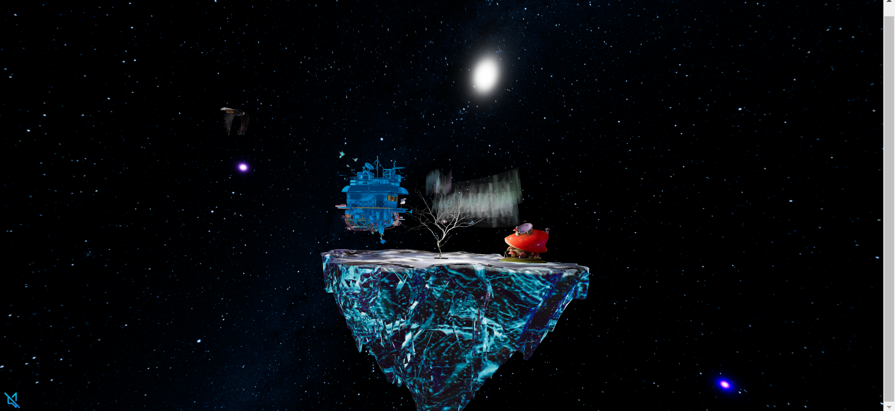
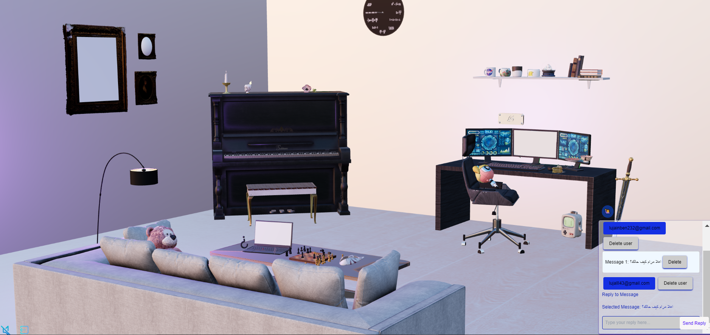
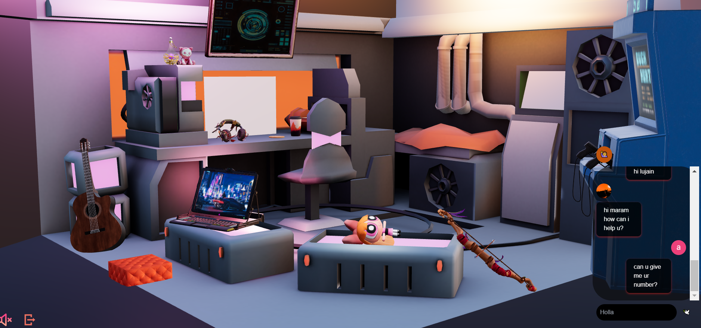
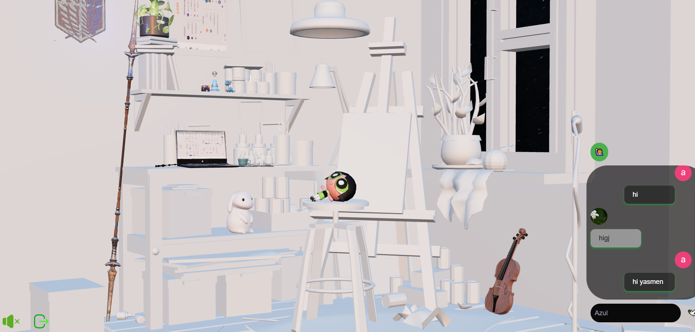
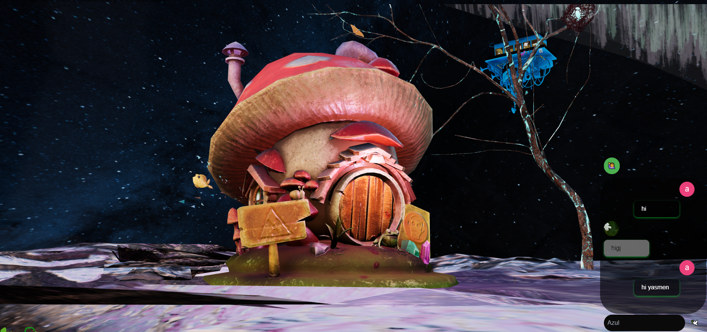
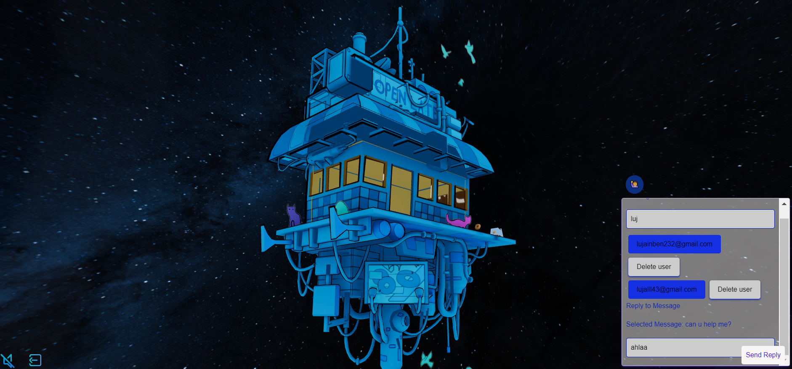

# Lymonada Project

## Overview

Lymonada is a unique 3D project that showcases a virtual world with three distinct rooms, each representing a member of the team with their unique personality. The project utilizes Sketchfab for 3D modeling and rendering, employing GLTF and GLB formats for seamless integration. Additionally, each room features an interactive chat system powered by Firebase, enhancing the user experience with real-time communication. The project is built using Three.js, a popular JavaScript library for creating and displaying animated 3D computer graphics in a web browser.

## Fun Facts

- **Inspiration**: The concept of Lymonada was inspired by the desire to create a virtual space where team members could showcase their unique personalities and talents, fostering a sense of community and collaboration.
- **Technology Choices**: The decision to use Sketchfab for 3D modeling and rendering was driven by its ease of use and the ability to create high-quality 3D models with minimal effort.
- **Real-time Chat**: The integration of Firebase for real-time chat functionality was a game-changer, enabling users to communicate instantly and enhance their experience within the virtual world.
- **Accessibility**: Lymonada is designed with accessibility in mind, ensuring that users with disabilities can navigate through the rooms and engage with the chat system without any barriers.
- **Sustainability**: The project emphasizes sustainable practices in 3D modeling and development, using resources efficiently and promoting recycling and reuse of materials.

## Installation

### Prerequisites

- Node.js
- npm

### Installing

1. Clone the repository

2. Install dependencies

npm install

3.Start the development server

npm run div

## Usage

To explore the Lymonada world, navigate through the three rooms. Each room is designed to reflect the personality of a team member, offering a unique experience. Engage with the interactive chat system in each room to communicate with others in real-time.

## Technologies Used

- **React**: For building the user interface.
- **ReactDOM**: For rendering the React components to the DOM.
- **Tailwind CSS**: For styling the application.
- **Firebase**: For implementing the chat functionality and user authentication.
- **React Router**: For managing navigation between different parts of the application.
- **Sketchfab**: For 3D modeling and rendering.
- **Three.js**: For creating and displaying animated 3D computer graphics in a web browser.

## Contributing

If you're interested in contributing to the Lymonada project, please fork the repository and use a feature branch. Pull requests are welcome!

## License

This project is licensed under the MIT License - see the LICENSE.md file for details.

## Acknowledgments

- Thanks to the Sketchfab community for providing tools and resources for 3D modeling.
- Acknowledgment to Firebase for enabling real-time chat functionality.
- Special thanks to the team members for their unique contributions to the project.
- Acknowledgment to Three.js for its powerful capabilities in 3D graphics.
- A heartfelt thank you to ALX School in Africa for their invaluable support and guidance . Their encouragement and resources have been instrumental in bringing this project to life.

## Specific Contributions

- **Lights and Animations**: Created dynamic lighting and animations to enhance the 3D environment, making each room more immersive and engaging.
- **Sign-In and Sign-Out Functionality**: Implemented user authentication features, allowing users to sign in and sign out securely.
- **Room Owner CVs**: Ensured each room displays the CV of the room owner, providing users with insights into the personality and background of each team member.

## Technical Highlights

### Movement and Interaction

In Lymonada, users have the unique ability to move around the island in a circular path, offering a distinctive and engaging way to explore the virtual space. This movement mechanism is designed to enhance the user experience by providing a novel navigation method.

- **Circular Movement**: Users can navigate the island by moving in a circular path, offering a unique and immersive way to explore the virtual environment. This movement mechanism is implemented using Three.js, ensuring smooth and responsive navigation.

### Lighting and Atmosphere

The lighting and atmosphere in Lymonada are carefully crafted to enhance the mood and ambiance of each room. Dynamic lighting effects, including shadows and reflections, contribute to the realism and depth of the 3D models.

- **Dynamic Lighting**: Lymonada employs dynamic lighting techniques to create a realistic and immersive atmosphere. This includes adjustable light sources that change throughout the day, simulating natural lighting conditions.
- **Shadows and Reflections**: The project utilizes advanced shadow and reflection techniques to add depth and realism to the 3D models, enhancing the overall visual experience.

### Addition and Control of Code

The codebase of Lymonada is modular and well-organized, facilitating easy addition and control of features. This structure allows for continuous development and enhancement of the project.

- **Modular Code Structure**: The project is organized into modules, each responsible for a specific aspect of the application (e.g., rendering, chat system, user authentication). This modular approach makes it easier to add new features or modify existing ones.
- **Advanced Control Mechanisms**: Lymonada features advanced control mechanisms for managing the virtual environment. This includes scripts for controlling the movement of objects, managing user interactions, and adjusting the lighting and atmosphere.

## Project Showcase

### Land Overview

### Room 1 - The Creative Hub

### Room 2 - The Tech Corner

### Room 3 - The Artistic Haven

### Chat System Interface

### Admin Interface

## Conclusion

Lymonada is more than just a 3D project; it's a testament to the power of technology in creating immersive, interactive, and engaging virtual spaces. Through the integration of cutting-edge 3D modeling, real-time chat functionality, and a user-friendly interface, Lymonada offers a unique experience that fosters creativity, collaboration, and community. Whether you're a developer, an artist, or a tech enthusiast, Lymonada invites you to explore, create, and connect in a virtual world that celebrates diversity and innovation.
